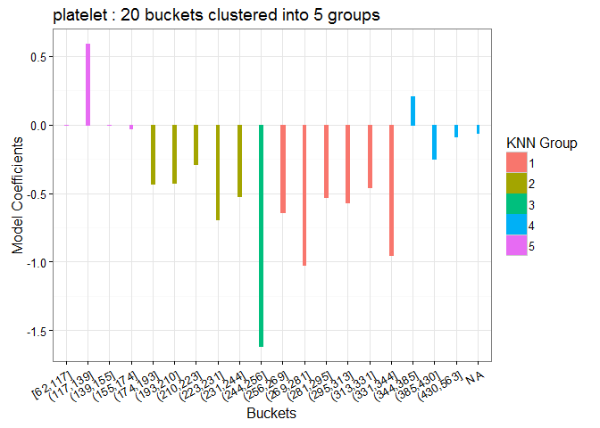
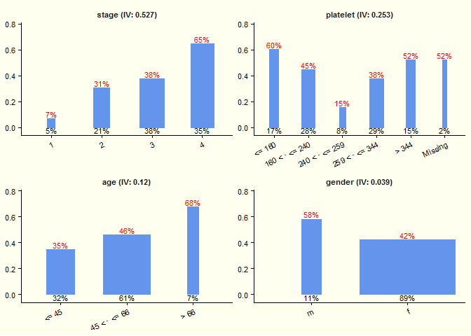
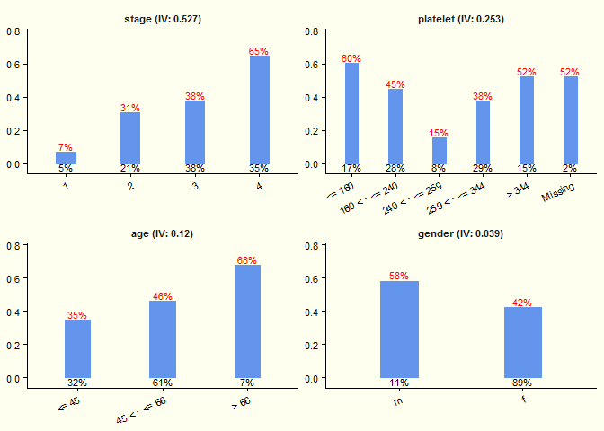
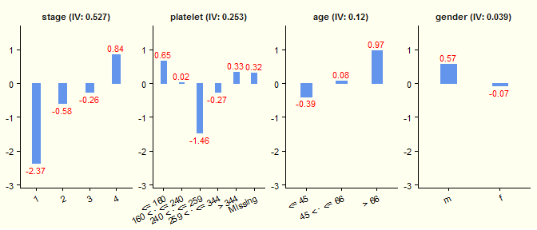
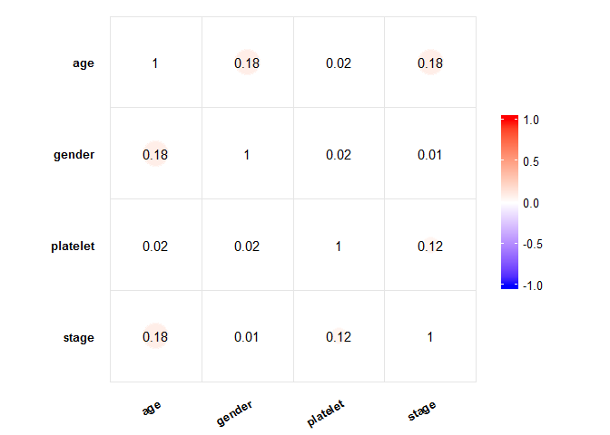
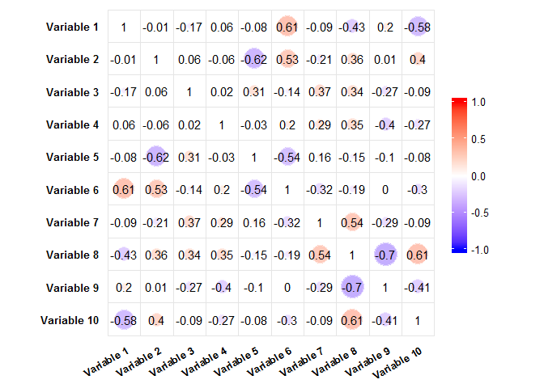
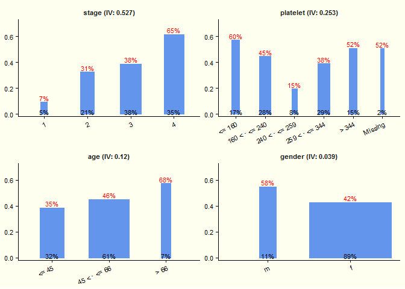

-   [Streamline Routine Modeling Work in R: streamlineR](#streamline-routine-modeling-work-in-r-streamliner)
    -   [Packages Setup](#packages-setup)
        -   [Install Dependent Packages](#install-dependent-packages)
        -   [Load Dependent Packages](#load-dependent-packages)
        -   [Install `streamlineR` from Github](#install-streamliner-from-github)
    -   [Data Preparation](#data-preparation)
        -   [Load Data](#load-data)
        -   [Split Data into Training and Test Datasets](#split-data-into-training-and-test-datasets)
    -   [Bin Training Data Based on Regression Coefficients: `bin.knn`](#bin-training-data-based-on-regression-coefficients-bin.knn)
    -   [Bin Training Data Based on rpart: `bin.rpart`](#bin-training-data-based-on-rpart-bin.rpart)
        -   [Decision Tree Algorithm (Recursive Partitioning): `rpart`](#decision-tree-algorithm-recursive-partitioning-rpart)
        -   [Binning for Logistic Model](#binning-for-logistic-model)
        -   [Binning for Survival Model](#binning-for-survival-model)
        -   [Search for Appropriate Number of Cut Points](#search-for-appropriate-number-of-cut-points)
        -   [Replace Numerical Varialbes with Bins](#replace-numerical-varialbes-with-bins)
    -   [Level Statistics (Frequence, Rate, WOE, and IV): `level.stat`](#level-statistics-frequence-rate-woe-and-iv-level.stat)
    -   [Visualize Level Statistics: `ggstat`](#visualize-level-statistics-ggstat)
        -   [Plot with Default Arguments](#plot-with-default-arguments)
        -   [Constant Bar Width](#constant-bar-width)
        -   [Plot WOE](#plot-woe)
        -   [Change Colors for Bar, Labels, and Background](#change-colors-for-bar-labels-and-background)
    -   [Replace Bins with WOE: `replace.woe`](#replace-bins-with-woe-replace.woe)
    -   [Correlation between Independent Variables: `ggcorr`](#correlation-between-independent-variables-ggcorr)
        -   [Plot with the base system: `corrplot`](#plot-with-the-base-system-corrplot)
        -   [Plot with the ggplot system: `ggcorr`](#plot-with-the-ggplot-system-ggcorr)
    -   [Logistic Model](#logistic-model)
        -   [Stepwise Variable Selection](#stepwise-variable-selection)
    -   [Prepare Test Data: `bin.custom & replace.woe`](#prepare-test-data-bin.custom-replace.woe)
        -   [Bin Test Data: `bin.custom`](#bin-test-data-bin.custom)
        -   [Replace Binned Test Data with WOE: `replace.woe`](#replace-binned-test-data-with-woe-replace.woe)
    -   [Model Performance: `perf.auc & perf.decile`](#model-performance-perf.auc-perf.decile)
        -   [Check Performance Based on AUC: `perf.auc`](#check-performance-based-on-auc-perf.auc)
        -   [Check Performance Based on Decile Rate: `perf.decile`](#check-performance-based-on-decile-rate-perf.decile)
    -   [Convert Coefficients to Rate: `coef2rate`](#convert-coefficients-to-rate-coef2rate)
    -   [Reference](#reference)

Streamline Routine Modeling Work in R: streamlineR
==================================================

**For an interactive presentation version, please check [here](https://jianhua.shinyapps.io/streamlineR_shinyapp/)**

This package is designed to streamline the routine modeling work, especially for scoring. It provides some handy functions to bin numerical variables, replace numerical variables with Weight of Evidence (WOE), ranking variables by Information Values (IV), plotting the successful/failure rates, check model performance based on AUC, and so on.This package also provides the useful function to convert the model output (e.g., coefficients) to graph/tables that are easier to understand for non-technical audience.

The following example illustrates how to use the `streamlineR` package to prepare data, build models, and visualize results.

Packages Setup
--------------

This analysis relies on other packages. If these packages are not available yet in your computer, you need to install them with the following commands.

#### Install Dependent Packages

``` r
# If the default mirror is blocked, choose another mirror to install R packages, 
# chooseCRANmirror()
sapply(c('dplyr', 'car', 'caret', 'e1071', 'knitr', 'reshape2', 'corrplot','rpart', 
  'scales', 'shiny', 'survival', 'gridExtra', 'devtools', 'pec', 'MASS', 'pROC', 
  'manipulate'), 
  install.packages)
```

#### Load Dependent Packages

After installing these packages, you need to load them into R, so that you can use the functions in those packages.

``` r
# Load pacakges
sapply(c('dplyr', 'car', 'caret', 'e1071', 'knitr', 'reshape2', 'corrplot','rpart', 
  'scales', 'survival', 'gridExtra', 'devtools', 'pec', 'MASS', 'pROC', 
  'manipulate'), 
  require, character.only = TRUE)
```

    ##      dplyr        car      caret      e1071      knitr   reshape2 
    ##       TRUE       TRUE       TRUE       TRUE       TRUE       TRUE 
    ##   corrplot      rpart     scales   survival  gridExtra   devtools 
    ##       TRUE       TRUE       TRUE       TRUE       TRUE       TRUE 
    ##        pec       MASS       pROC manipulate 
    ##       TRUE       TRUE       TRUE       TRUE

#### Install `streamlineR` from Github

The `streamlineR` package is under development on the Github platform. The package can be installed using the `install_github` function from the `devtools` package. If the `install_github` function does not work, you can download the package from [here](https://api.github.com/repos/JianhuaHuang/streamlineR/zipball/master), and then install the package locally in Rstudio (Tools -&gt; Install Packages -&gt; Install from -&gt; Package Archive File (.zip; .tar.gz))

``` r
# If the install_github does not work, you can download the package from github,
# and then install the package locally: 
# https://api.github.com/repos/JianhuaHuang/streamlineR/zipball/master 
devtools::install_github('JianhuaHuang/streamlineR')
library(streamlineR)
```

Data Preparation
----------------

In this example, I analyzed the primary biliary cirrhosis (PBC) data set from the survival package. The details of this data set is available [here](https://stat.ethz.ch/R-manual/R-devel/library/survival/html/pbc.html), or you can run `?survival::pbc` to find the data description within R.

#### Load Data

The data set can be loaded into R directly by calling the data from the package. Because the sample size is a little small, I increased the sample size by resampling the data 10000 times.

``` r
dt <- survival::pbc %>%
  transmute(age = round(age), gender = sex, platelet, stage = as.character(stage), 
    time, status = as.numeric(status %in% c(1, 2))) %>%
  filter(!is.na(stage))

set.seed(1111)  # reproducible
dt <- dt[sample(nrow(dt), 10000, replace = T), ]
row.names(dt) <- NULL
dim(dt)
```

    ## [1] 10000     6

``` r
str(dt)
```

    ## 'data.frame':    10000 obs. of  6 variables:
    ##  $ age     : num  53 53 33 54 43 43 42 61 57 45 ...
    ##  $ gender  : Factor w/ 2 levels "m","f": 2 2 2 2 2 2 2 2 2 1 ...
    ##  $ platelet: int  344 361 418 216 275 214 102 233 231 NA ...
    ##  $ stage   : chr  "4" "3" "3" "3" ...
    ##  $ time    : int  2443 2574 1725 3282 1216 1067 1197 708 1978 4459 ...
    ##  $ status  : num  0 0 1 1 0 0 1 1 0 0 ...

``` r
head(dt)
```

    ##   age gender platelet stage time status
    ## 1  53      f      344     4 2443      0
    ## 2  53      f      361     3 2574      0
    ## 3  33      f      418     3 1725      1
    ## 4  54      f      216     3 3282      1
    ## 5  43      f      275     3 1216      0
    ## 6  43      f      214     3 1067      0

#### Split Data into Training and Test Datasets

Before doing any analysis, I held out some data as test data set. The `createDataPartition` function (from `caret` package) is used to split the data into training and test data sets. The training data set is used to develop the model, and the test data set is used to test the model performance.

``` r
set.seed(1111)
ind.train <- createDataPartition(dt$status, p = .7, list = FALSE)
dt.train <- dt[ind.train, ]
dt.test <- dt[-ind.train, ]
row.names(dt.train) <- NULL
row.names(dt.test) <- NULL
dim(dt.train)
```

    ## [1] 7000    6

``` r
dim(dt.test)
```

    ## [1] 3000    6

``` r
# preserve the original values
dt.train.bk <- dt.train
dt.test.bk <- dt.test
```

Bin Training Data Based on Regression Coefficients: `bin.knn`
-------------------------------------------------------------

Before building the model with training data, we may need to convert some numerical variables to categorical variables by binning the numerical values into different groups, so that we can model the non-linear relationship between the independent and dependent variables. This package provides two methods to find the cut points for binning: `bin.knn` and `bin.rpart`.

The `bin.knn` method finds the cut points based on the regression coefficients using the KNN algorithm. Generally, the `bin.knn` finds the cut points through the following steps:

1.  Divide the independent variable x into some small bucket (e.g., 20 bucket)
2.  Build a univariate model using x and y
3.  Get the regression coefficients for each bucket
4.  Use the KNN algorithm to bin the buckets into bigger groups (e.g., 5 groups), based on their orders and regression coefficients.

The `bin.knn` method can now deal with Generalized Linear Models (GLM) and Survival Model (class of coxph in R). The `bin.knn` function takes four arguments: formula, data, n.group, and min.bucket. The min.bucket is the minimum ratio of records in each bucket. The min.bucket should be small enough to make that there are enough buckets for binning, and big enough to guarantee that the estimated regression coefficients are statistically reliable for all buckets.

The following function bins the 20 buckets (including NA) into 5 groups represented by different colors. We can extract the cut points based on the colors for different groups.

``` r
bin.knn(status ~ platelet, data = dt.train, n.group = 5, min.bucket = 0.05)
```



Although the `bin.knn` function take into account both the order and coefficient of each bucket, it may bin some buckets together if the coefficients for some neighboring buckets are very different. In this case, we may need to change the number of groups and/or buckets by adjusting the `n.group` and/or `min.bucket` argument. This can be done interactively using the manipulate function as follows:

``` r
manipulate(bin.knn(status ~ platelet, data = dt.train, n.group, min.bucket),
  n.group = slider(1, 10, step = 1, initial = 5, label = 'Number of Groups'),
  min.bucket = slider(0.01, .2, step = 0.01, initial = 0.05,
    label = 'Minimum Population'))
```

By changing the `n.group` and `min.bucket` repeatedly, we may be able to find the appropriate cut points.

Bin Training Data Based on rpart: `bin.rpart`
---------------------------------------------

Although the `bin.knn` method is intuitive and provides the visualization, it is difficult to find the optimal cut points manually. Another binning method `bin.rpart`, can help us to find the optimal cut points automatically, and can be applied to more models.

#### Decision Tree Algorithm (Recursive Partitioning): `rpart`

The `bin.rpart` relies on the output from `rpart` (recursive partitioning), a famous algorithm used to build the decision tree. The `rpart` function can produce the optimal splits of numerical data, and generates a tree-structure nodes. Based on these splits and nodes, we can extract the cut points and bin the numerical values into different groups.

``` r
rpart(formula = status ~ age, data = dt.train, 
  control = rpart.control(minbucket = .01 * nrow(dt.train)))
```

    ## n= 7000 
    ## 
    ## node), split, n, deviance, yval
    ##       * denotes terminal node
    ## 
    ## 1) root 7000 1726.2190 0.4417143  
    ##   2) age< 66.5 6480 1581.4200 0.4228395  
    ##     4) age< 45.5 2241  509.1200 0.3489514 *
    ##     5) age>=45.5 4239 1053.5970 0.4619014 *
    ##   3) age>=66.5 520  113.7231 0.6769231 *

#### Binning for Logistic Model

The usage of `bin.rpart` is very similar `rpart`, except that the *control* argument in `rpart` is named as *rcontrol* in `bin.rpart`. The following code generates the cut points and bins for **age** and **platelet**. The cut points (cut.points) and bins are saved in a list as the function outputs.

``` r
lg.bin.age <- bin.rpart(formula = status ~ age, data = dt.train, 
  rcontrol = rpart.control(minbucket = .01 * nrow(dt.train)))
```

    ## age : 45 66

``` r
str(lg.bin.age)
```

    ## List of 2
    ##  $ cut.points: num [1:2] 45 66
    ##  $ bins      : Factor w/ 3 levels "<= 45","45 < · <= 66",..: 2 2 1 2 2 2 2 2 2 2 ...

``` r
lg.bin.platelet <- bin.rpart(formula = status ~ platelet, data = dt.train, 
  rcontrol = rpart.control(minbucket = .01 * nrow(dt.train)))
```

    ## platelet : 160 240 259 344

#### Binning for Survival Model

Compared to other packages (such as `smbinning` and `woe`) that only provides binning for logistic model, `bin.rpart` can provide the optimal binning for all models that can be passed to the `rpart` function. For example, the `bin.rpart` function can generate the optimal cut points of **age** in a survival model, if we change the dependent variable to a survival object (`Surv(time, status)`) in the formula.

``` r
surv.bin.age <- bin.rpart(formula = Surv(time, status) ~ age, data = dt.train,
  rcontrol = rpart.control(minbucket = .05 * nrow(dt.train)))  ## cp = 0.01
```

    ## age : 65

#### Search for Appropriate Number of Cut Points

By default, the cp (complexity parameter used to control `rpart`. The detail of the *cp* argument can be checked with `?rpart.control`) is set as 0.01, which is a little conservative for the survival model. Thus the number of cut points is usually small for the survival model, if we use the default *cp* value. We can reduce the *cp* value (e.g., 0.001) to get more cut points. We may be able to achieve an appropriate number of cut points by changing the *cp* argument repeatedly.

In stead of changing the *cp* argument manually, the *n.group* (number of acceptable binning groups, can be a single number or a range) argument can help to find the appropriate number of cut points automatically. For example, if we set the acceptable *n.group* as 3:7, the `bin.rpart` function will try different *cp*, until the number of binning groups is within 3 to 7 (or the number of cut points within 2:6).

``` r
surv.bin.age2 <- bin.rpart(formula = Surv(time, status) ~ age, data = dt.train,
  rcontrol = rpart.control(minbucket = .05 * nrow(dt.train)), n.group = 3:7)
```

    ## age : 45 65

#### Replace Numerical Varialbes with Bins

After binning, we can replace the original numerical values with the corresponding bins saved in the outputs from `bin.rpart`.

``` r
# We don't need the time column anmore, delete it in both dt.train and dt.test
dt.train <- dplyr::select(dt.train, -time)  
dt.test <- dplyr::select(dt.test, -time)
head(dt.train)
```

    ##   age gender platelet stage status
    ## 1  53      f      344     4      0
    ## 2  53      f      361     3      0
    ## 3  43      f      214     3      0
    ## 4  61      f      233     4      1
    ## 5  59      f      190     4      1
    ## 6  62      f      234     2      0

``` r
dt.train$age <- lg.bin.age$bins
dt.train$platelet <- lg.bin.platelet$bins
head(dt.train)
```

    ##            age gender       platelet stage status
    ## 1 45 < · <= 66      f 259 < · <= 344     4      0
    ## 2 45 < · <= 66      f          > 344     3      0
    ## 3        <= 45      f 160 < · <= 240     3      0
    ## 4 45 < · <= 66      f 160 < · <= 240     4      1
    ## 5 45 < · <= 66      f 160 < · <= 240     4      1
    ## 6 45 < · <= 66      f 160 < · <= 240     2      0

After replacing the numerical variables with bins, the numerical variables are converted to categorical variables automatically.

Level Statistics (Frequence, Rate, WOE, and IV): `level.stat`
-------------------------------------------------------------

For all of the categorical variables, it is useful to calculate some statistics (e.g., population frequency, good/bad rates, and WOE) for different levels and variables, before building the models. The `level.stat` function is designed for this purpose. In order to use the `level.stat` function, the dependent variable (y) should be binary, and you should specify which value is flagged as 0/1 in the `level.stat` output.

``` r
col.x <- c('age', 'gender', 'platelet', 'stage')
stat.train <- level.stat(dt.train, x = col.x, y = 'status', flag.0 = 0, flag.1 = 1)
head(stat.train)
```

    ##   Variable          Group Freq.0 Freq.1 Freq.group    Rate.0     Rate.1
    ## 1    stage              1    337     25        362 0.9309392 0.06906077
    ## 2    stage              2   1034    456       1490 0.6939597 0.30604027
    ## 3    stage              3   1669   1016       2685 0.6216015 0.37839851
    ## 4    stage              4    868   1595       2463 0.3524158 0.64758425
    ## 5 platelet         <= 160    464    705       1169 0.3969204 0.60307956
    ## 6 platelet 160 < · <= 240   1082    871       1953 0.5540195 0.44598054
    ##   Rate.group Perc.0 Perc.1 Perc.group    Distr.0     Distr.1         WOE
    ## 1 0.05171429    93%     7%         5% 0.08623337 0.008085382 -2.36699950
    ## 2 0.21285714    69%    31%        21% 0.26458547 0.147477361 -0.58448964
    ## 3 0.38357143    62%    38%        38% 0.42707267 0.328589909 -0.26214369
    ## 4 0.35185714    35%    65%        35% 0.22210850 0.515847348  0.84264490
    ## 5 0.16700000    40%    60%        17% 0.11873081 0.228007762  0.65252085
    ## 6 0.27900000    55%    45%        28% 0.27686796 0.281694696  0.01728312
    ##   WOE.round        IV          Variable.IV
    ## 1     -2.37 0.5267589    stage (IV: 0.527)
    ## 2     -0.58 0.5267589    stage (IV: 0.527)
    ## 3     -0.26 0.5267589    stage (IV: 0.527)
    ## 4      0.84 0.5267589    stage (IV: 0.527)
    ## 5      0.65 0.2525191 platelet (IV: 0.253)
    ## 6      0.02 0.2525191 platelet (IV: 0.253)

Visualize Level Statistics: `ggstat`
------------------------------------

In accompany with the `level.stat` function, is the visualization of its output using the `ggstat` function. The `ggstat` function employs the `ggplot2` package to plot the statistics for different groups and variables.

#### Plot with Default Arguments

``` r
ggstat(data = stat.train, var = "Variable.IV", x = "Group", y = "Rate.1", 
    y.label = "Perc.1", y.label.col = "red", y.title = NULL, 
    bar.col = "cornflowerblue", width = "Rate.group", width.label = "Perc.group", 
    width.label.col = "black", ncol = NULL, theme = "classic", 
    background = "white")
```



The `ggstat` function takes multiple arguments. All of the arguments have default values, except the first one (data). You only need to specify the data, which is usually the output from the `level.stat` function (It can also be other data, but the default arguments need to be changed.), to plot the *Rate.1* for different groups and variables.

#### Constant Bar Width

The default arguments can be changed to other values to make the plot looks different. For example, if we don't want to use width of the bar to represent the ratio of population in each group, we can set `width = XX` (where XX is a numerical value), so that the same width is used for each bar.

``` r
ggstat(stat.train, width = .2)
```



#### Plot WOE

We can also plot other statistics (e.g., "WOE") by changing the *y* value to `y = 'WOE'`, and and *y.label* to `y.label = 'WOE.round'`. We can also set the number of columns for the plot by changing the *ncol* argument.

``` r
ggstat(stat.train, y = 'WOE', y.label = 'WOE.round', width = .2, 
  width.label = NULL, ncol = 4)
```



#### Change Colors for Bar, Labels, and Background

In order to make the plots look diverse, you can also change the colors for the bar, the labels for y and bar width, and the background. A lot of colors can be used in the plot. We can use the handy `display.col()` function to show the possible colors:

``` r
display.col()  # reference to http://sape.inf.usi.ch/quick-reference/ggplot2/colour 
```


You can pick your favorite colors for different elements in the `ggstat` function:

``` r
ggstat(stat.train, width = .2, y.label.col = 'white', bar.col = 'black',
  width.label.col = 'blue', background = 'green')
```


Replace Bins with WOE: `replace.woe`
------------------------------------

For logistic model, sometimes it is useful to convert original categorical variables into numeric WOE value, since it can guarantee the linearity between the dependent and independent variables. The *replace* argument can be used to control whether the original values should be replaced (`replace = TRUE`) or not (\`replace = FALSE'). If the *replace* argument is set to *TRUE*, the original values will be replaced by the corresponding WOE values directly. If the *replace* argument is set to *FALSE*, the *WOE* value will be added as a new column with \*\_woe\* appended to the original column name.

``` r
replace.woe(data = dt.train, stat = stat.train, replace = FALSE) %>%
  head
```

    ##            age gender       platelet stage status    age_woe  gender_woe
    ## 1 45 < · <= 66      f 259 < · <= 344     4      0  0.0815172 -0.06899025
    ## 2 45 < · <= 66      f          > 344     3      0  0.0815172 -0.06899025
    ## 3        <= 45      f 160 < · <= 240     3      0 -0.3894442 -0.06899025
    ## 4 45 < · <= 66      f 160 < · <= 240     4      1  0.0815172 -0.06899025
    ## 5 45 < · <= 66      f 160 < · <= 240     4      1  0.0815172 -0.06899025
    ## 6 45 < · <= 66      f 160 < · <= 240     2      0  0.0815172 -0.06899025
    ##   platelet_woe  stage_woe
    ## 1  -0.26727216  0.8426449
    ## 2   0.33075749 -0.2621437
    ## 3   0.01728312 -0.2621437
    ## 4   0.01728312  0.8426449
    ## 5   0.01728312  0.8426449
    ## 6   0.01728312 -0.5844896

``` r
dt.train <- replace.woe(data = dt.train, stat = stat.train, 
  replace = TRUE)
head(dt.train)
```

    ##          age      gender    platelet      stage status
    ## 1  0.0815172 -0.06899025 -0.26727216  0.8426449      0
    ## 2  0.0815172 -0.06899025  0.33075749 -0.2621437      0
    ## 3 -0.3894442 -0.06899025  0.01728312 -0.2621437      0
    ## 4  0.0815172 -0.06899025  0.01728312  0.8426449      1
    ## 5  0.0815172 -0.06899025  0.01728312  0.8426449      1
    ## 6  0.0815172 -0.06899025  0.01728312 -0.5844896      0

Correlation between Independent Variables: `ggcorr`
---------------------------------------------------

#### Plot with the base system: `corrplot`

Another advantage of converting categorical values to WOE is that we can calculate the correlation between all independent variables, since they are all numeric values.In order to do this, we need to calculate the correlation matrix between the independent variables, and then visualize them using `ggcorr`. The idea of `ggcorr` originates from the `corrplot` function in the `corrplot` package. The `corrplot` function is based on the base R plot system, while the `ggcorr` function is based on the ggplot system. With the default setting, you can generate the `corrplot` as follows:

``` r
cor.mat <- cor(dt.train[, col.x])
corrplot(cor.mat)
```


#### Plot with the ggplot system: `ggcorr`

The `ggcorr` function is a simplified version of the `corrplot`, which only include a few arguments that may be useful to most users. Compared to the `corrplot` function, the diagonal big dots are removed, because we don't want to highlight those values. Since the plot is based on the ggplot system, the figure can be saved with the `ggsave` function directly. By default, the `ggcorr` generate a figure looks like this:

``` r
ggcorr(cor.mat)
```



You can change a few options in the function to personalize the plot:

-   lower: whether you only want the lower triangle
-   psize: the point size for the correlation
-   high: the color represents the high (positive) correlation
-   low: the color represents the low (negative) correlation
-   digit: the number of digits for the correlation values
-   var.position: the position to put the variable names (*axis*, *diagonal*)
-   var.angle: set the angle for the variables, to avoid overlap of the text
-   add.legend: whether to add the legend for color (TRUE/FALSE)

Using the following randomly-generated data as an example, you can get different plots by changing a few arguments:

``` r
set.seed(1111)
data.random <- matrix(runif(100), 10)
colnames(data.random) <- paste('Variable', 1:10)
cor.random <- cor(data.random)

ggcorr(cor.random)  # default output
```



``` r
ggcorr(cor.random, var.position = 'diagonal', add.legend = FALSE)
```


``` r
ggcorr(cor.random, lower = TRUE)
```


``` r
ggcorr(cor.random, lower = TRUE, var.position = 'diagonal', high = 'blue', 
  low = 'green')
```


Logistic Model
--------------

With the WOE values, we are ready to build the logistic regression model with the training data set. \#\#\#\# Full Model

``` r
lg <- glm(status ~ ., dt.train, family=binomial(link='logit'))
summary(lg)
```

    ## 
    ## Call:
    ## glm(formula = status ~ ., family = binomial(link = "logit"), 
    ##     data = dt.train)
    ## 
    ## Deviance Residuals: 
    ##     Min       1Q   Median       3Q      Max  
    ## -2.1894  -0.9819  -0.4810   1.0177   2.3207  
    ## 
    ## Coefficients:
    ##             Estimate Std. Error z value Pr(>|z|)    
    ## (Intercept) -0.22287    0.02645  -8.427  < 2e-16 ***
    ## age          0.66073    0.07844   8.423  < 2e-16 ***
    ## gender       0.91794    0.13786   6.658 2.77e-11 ***
    ## platelet     0.91373    0.05535  16.508  < 2e-16 ***
    ## stage        0.90668    0.03928  23.083  < 2e-16 ***
    ## ---
    ## Signif. codes:  0 '***' 0.001 '**' 0.01 '*' 0.05 '.' 0.1 ' ' 1
    ## 
    ## (Dispersion parameter for binomial family taken to be 1)
    ## 
    ##     Null deviance: 9608.7  on 6999  degrees of freedom
    ## Residual deviance: 8327.6  on 6995  degrees of freedom
    ## AIC: 8337.6
    ## 
    ## Number of Fisher Scoring iterations: 4

#### Stepwise Variable Selection

Then, we can select the significant variables with the `stepAIC` function from the `MASS` package. It is worth to mention that there is no argument that controls the p-to-enter directly in the function, since the variable selection is based on AIC. Instead, we can adjust the *k* value to control the threshold for a variable to enter into the model. For discussion about the usage of *k* argument, please refer to this [thread](http://stats.stackexchange.com/questions/97257/stepwise-regression-in-r-critical-p-value)

``` r
lg.aic <- stepAIC(lg, k =  qchisq(0.05, 1, lower.tail=F))   # p to enter: 0.05
```

    ## Start:  AIC=8346.84
    ## status ~ age + gender + platelet + stage
    ## 
    ##            Df Deviance    AIC
    ## <none>          8327.6 8346.8
    ## - gender    1   8372.5 8387.9
    ## - age       1   8400.5 8415.9
    ## - platelet  1   8635.1 8650.5
    ## - stage     1   8960.3 8975.7

``` r
summary(lg.aic)
```

    ## 
    ## Call:
    ## glm(formula = status ~ age + gender + platelet + stage, family = binomial(link = "logit"), 
    ##     data = dt.train)
    ## 
    ## Deviance Residuals: 
    ##     Min       1Q   Median       3Q      Max  
    ## -2.1894  -0.9819  -0.4810   1.0177   2.3207  
    ## 
    ## Coefficients:
    ##             Estimate Std. Error z value Pr(>|z|)    
    ## (Intercept) -0.22287    0.02645  -8.427  < 2e-16 ***
    ## age          0.66073    0.07844   8.423  < 2e-16 ***
    ## gender       0.91794    0.13786   6.658 2.77e-11 ***
    ## platelet     0.91373    0.05535  16.508  < 2e-16 ***
    ## stage        0.90668    0.03928  23.083  < 2e-16 ***
    ## ---
    ## Signif. codes:  0 '***' 0.001 '**' 0.01 '*' 0.05 '.' 0.1 ' ' 1
    ## 
    ## (Dispersion parameter for binomial family taken to be 1)
    ## 
    ##     Null deviance: 9608.7  on 6999  degrees of freedom
    ## Residual deviance: 8327.6  on 6995  degrees of freedom
    ## AIC: 8337.6
    ## 
    ## Number of Fisher Scoring iterations: 4

``` r
data.frame(vif(lg.aic))  # check the multicollinearity between predictors
```

    ##          vif.lg.aic.
    ## age         1.044983
    ## gender      1.032425
    ## platelet    1.004376
    ## stage       1.019196

Prepare Test Data: `bin.custom & replace.woe`
---------------------------------------------

After building the model, we need to check the model performance using the test data, which we hold out at the very beginning of the analysis. In order to use the test data to check the model performance, we need to convert the original values to bins, and then to WOE, so that it can be used in the model.

#### Bin Test Data: `bin.custom`

In order to bin the test data, we need to use the `bin.custom` function. This function requires two arguments: the data needed to be binned, and its cut points. Since we already saved the optimal cut points for the training data, we can use those cut points to cut the test data into different bins directly.

``` r
head(dt.test)
```

    ##   age gender platelet stage status
    ## 1  33      f      418     3      1
    ## 2  54      f      216     3      1
    ## 3  43      f      275     3      0
    ## 4  42      f      102     4      1
    ## 5  57      f      231     3      0
    ## 6  45      m       NA     1      0

``` r
dt.test$age <-  bin.custom(dt.test$age, cut.p = lg.bin.age$cut.points)
dt.test$platelet <- bin.custom(dt.test$platelet, cut.p = lg.bin.platelet$cut.points)
head(dt.test)
```

    ##            age gender       platelet stage status
    ## 1        <= 45      f          > 344     3      1
    ## 2 45 < · <= 66      f 160 < · <= 240     3      1
    ## 3        <= 45      f 259 < · <= 344     3      0
    ## 4        <= 45      f         <= 160     4      1
    ## 5 45 < · <= 66      f 160 < · <= 240     3      0
    ## 6        <= 45      m        Missing     1      0

#### Replace Binned Test Data with WOE: `replace.woe`

After converting the original numeric values into different bins, then we can replace the bins with the corresponding WOE values estimated based on the training data.

``` r
dt.test <- replace.woe(dt.test, stat = stat.train, replace = TRUE)
head(dt.test)
```

    ##          age      gender    platelet      stage status
    ## 1 -0.3894442 -0.06899025  0.33075749 -0.2621437      1
    ## 2  0.0815172 -0.06899025  0.01728312 -0.2621437      1
    ## 3 -0.3894442 -0.06899025 -0.26727216 -0.2621437      0
    ## 4 -0.3894442 -0.06899025  0.65252085  0.8426449      1
    ## 5  0.0815172 -0.06899025  0.01728312 -0.2621437      0
    ## 6 -0.3894442  0.56703353  0.31808909 -2.3669995      0

Model Performance: `perf.auc & perf.decile`
-------------------------------------------

Now, with the test data in shape of WOE values, we can check the model performance based on AUC (Area Under Curve) or decile rates.

#### Check Performance Based on AUC: `perf.auc`

In order to check the performance of AUC, the `perf.auc` function requires the model, the training data, and the test data. Then the function will generate the AUC and ROC curve for both the training and test data sets.

``` r
perf.auc(model = lg.aic, dt.train, dt.test)
```


#### Check Performance Based on Decile Rate: `perf.decile`

Thought the AUC makes sense to some technical people who know statistics well, it may not be sensible to the non-technical audience. In order to introduce the model performance in a way that is easier to understand, we may need the `perf.decile` function. This function takes the actual status (*actual*), and the predicted probability (*pred*) as inputs, and generate the performance figure in the following steps:

1.  Rank the *pred* probability, and divide the records into 10 different groups (deciles)
2.  Calculate the actual and predicted rates in each decile
3.  Plot the actual and predicted rates, together with the diagonal reference line.

If a model performs well, the predicted rates should match with the actual values well, which means the decile points should be around the reference line, and the good deciles should be far away from the bad deciles.

``` r
pred.test <- predict(lg.aic, newdata = dt.test, type = 'response')
perf.decile(actual = dt.test$status, pred = pred.test, add.legend = TRUE)
```



    ## Source: local data frame [10 x 6]
    ## 
    ##    Decile Actual.rate Predict.rate Freq.1 Freq.0 Freq.group
    ##     <int>       <dbl>        <dbl>  <dbl>  <dbl>      <int>
    ## 1       1    6.666667     10.11034     20    280        300
    ## 2       2   33.333333     25.05685    100    200        300
    ## 3       3   17.666667     30.32782     53    247        300
    ## 4       4   30.666667     32.89736     92    208        300
    ## 5       5   43.333333     38.65204    130    170        300
    ## 6       6   38.666667     42.91491    116    184        300
    ## 7       7   48.333333     51.01753    145    155        300
    ## 8       8   78.666667     60.93081    236     64        300
    ## 9       9   65.333333     70.64118    196    104        300
    ## 10     10   76.333333     79.12887    229     71        300

Convert Coefficients to Rate: `coef2rate`
-----------------------------------------

After checking the model performance, it is also useful to produce the regression model outputs in a audience-friendly style. Since the model is built with WOE, the explanation of the regression coefficients is a bit difficult, since it doesn't relate to the original data directly. The `coef2rate` function is designed to convert these coefficients back to the good/bad rates for each group and variables, so that the non-technical audience can understand it easily. The `coef2rate` function works in two different ways dependent on whether *force.change* is *FALSE* or *TRUE*:

-   If *force.change* is set to *FALSE*, the function will estimate the predicted value for each record of the given *data* using the given *model*. Then, average the predicted value for each group (if the WOE is used for modeling, the group will be WOE value) and variable.
-   If the *force.change* is set to *TRUE*, the function will go through each predictor, force the value in this predictor to be one of its group (WOE) and keep all other predictors unchanged, and then calculate the predicted value for each record. By averaging the values for all record, we get a single *Pred.Rate.1* for the given group and predictor. We can get the average predicted value for all groups and predictors, by going through them one by one. The idea behind *force.change* originates from the interpretation of regression coefficients - keep all other variables unchanged, and only change the value for one predictor. By doing this, we can get the pure effect of that variable.

``` r
pred.stat <- coef2rate(model = lg.aic, data = dt.test, 
  stat = stat.train, force.change = TRUE)
head(pred.stat)
```

    ##   Variable          Variable.IV          Group Freq.group Rate.group
    ## 1    stage    stage (IV: 0.527)              1        157 0.05233333
    ## 2    stage    stage (IV: 0.527)              2        643 0.21433333
    ## 3    stage    stage (IV: 0.527)              3       1127 0.37566667
    ## 4    stage    stage (IV: 0.527)              4       1073 0.35766667
    ## 5 platelet platelet (IV: 0.253)         <= 160        492 0.16400000
    ## 6 platelet platelet (IV: 0.253) 160 < · <= 240        879 0.29300000
    ##   Perc.group Pred.Rate.1 Pred.Perc.1
    ## 1         5%  0.09452027          9%
    ## 2        21%  0.32716770         33%
    ## 3        38%  0.38981254         39%
    ## 4        36%  0.61801045         62%
    ## 5        16%  0.57420979         57%
    ## 6        29%  0.44853001         45%

After calculating the *Pred.Rate.1*, we can again plot it using the ggstat function by setting `y = 'Pred.Rate.1'`

``` r
ggstat(pred.stat, y = 'Pred.Rate.1',  y.label = 'Pred.Perc.1')
```


Reference
---------

-   streamlineR package information: <https://github.com/JianhuaHuang/streamlineR>
-   Submit bug: <http://github.com/JianhuaHuang/streamlineR/issues>
