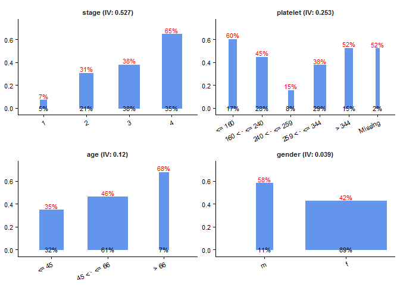
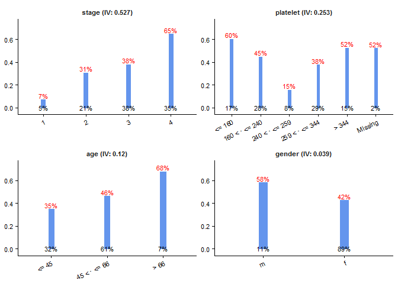
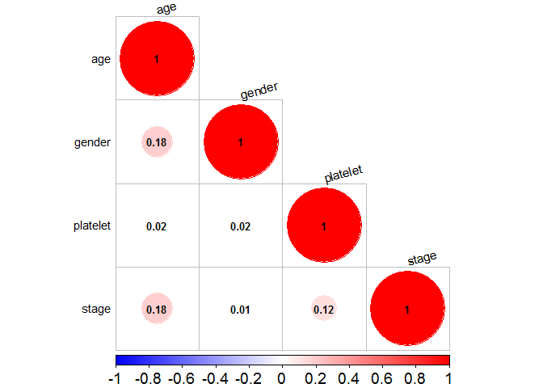
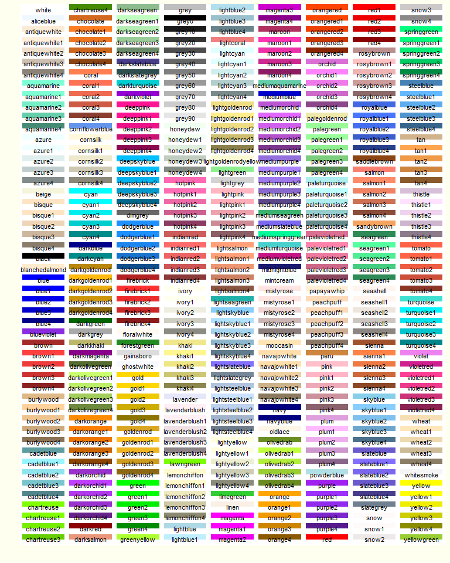
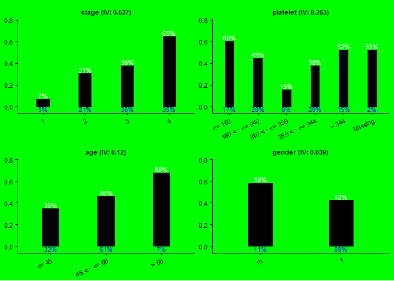

Streamline Rountine Modeling Work in R: streamit
================================================

This package is designed to streamline the routine modeling work, especially for scoring. It provides some handy functions to bin numerical variables, replace numerical variables with Weight of Evidence (WOE), ranking varialbes by Information Values (IV), plotting the successful/failure rates, check model performance based on AUC, and so on.This package also provides the useful function to convert the model output (e.g., coefficients) to graph/tables that are easier to understand for non-technical audience.

The following example illustrates how to use the streamit package to prepare data, build models, and generate figures.

R Setup
-------

This analysis relies on other packages. If these packges are not available yet in your computer, you need to install them with the following commands.

``` r
# in case the default mirror is blocked in your domain, choose another one
chooseCRANmirror()  
sapply(c('dplyr', 'caret', 'e1071', 'knitr', 'reshape2', 'corrplot','rpart',
  'scales', 'survival', 'gridExtra', 'devtools', 'pec', 'MASS', 'pROC'),
  install.packages)
```

After installing these packages, you need to load them into R, and use the `install_github` function in the `devtools` package to install the `streamit` package on github.

``` r
# Load packages
sapply(c('caret', 'corrplot', 'devtools', 'dplyr','e1071', 'gridExtra', 'knitr',
  'MASS', 'pec', 'pROC', 'rpart',  'reshape2', 'scales', 'survival'), 
  require, character.only = TRUE)
```

    ##     caret  corrplot  devtools     dplyr     e1071 gridExtra     knitr 
    ##      TRUE      TRUE      TRUE      TRUE      TRUE      TRUE      TRUE 
    ##      MASS       pec      pROC     rpart  reshape2    scales  survival 
    ##      TRUE      TRUE      TRUE      TRUE      TRUE      TRUE      TRUE

``` r
# install the streamit package via github
install_github('JianhuaHuang/streamit')
library(streamit)
```

In this example, I analyzed the primary biliary cirrhosis (PBC) dataset from the survival package. The details of this dataset is availalble [here](https://stat.ethz.ch/R-manual/R-devel/library/survival/html/pbc.html), or you can run `?survival::pbc` to find the data description within R. Because the sample size is a little small, I increased the sample size by resampling the data 10000 times.

Data Preparation
----------------

``` r
dt <- survival::pbc %>%
  transmute(age = round(age), gender = sex, platelet, stage = as.character(stage), 
    time, status = as.numeric(status %in% c(1, 2))) %>%
  filter(!is.na(stage))

set.seed(1111)
dt <- dt[sample(nrow(dt), 10000, replace = T), ]
dim(dt)
```

    ## [1] 10000     6

``` r
str(dt)
```

    ## 'data.frame':    10000 obs. of  6 variables:
    ##  $ age     : num  53 53 33 54 43 43 42 61 57 45 ...
    ##  $ gender  : Factor w/ 2 levels "m","f": 2 2 2 2 2 2 2 2 2 1 ...
    ##  $ platelet: int  344 361 418 216 275 214 102 233 231 NA ...
    ##  $ stage   : chr  "4" "3" "3" "3" ...
    ##  $ time    : int  2443 2574 1725 3282 1216 1067 1197 708 1978 4459 ...
    ##  $ status  : num  0 0 1 1 0 0 1 1 0 0 ...

``` r
head(dt)
```

    ##     age gender platelet stage time status
    ## 192  53      f      344     4 2443      0
    ## 171  53      f      361     3 2574      0
    ## 374  33      f      418     3 1725      1
    ## 57   54      f      216     3 3282      1
    ## 305  43      f      275     3 1216      0
    ## 403  43      f      214     3 1067      0

Split Data into Training and Test datasets
------------------------------------------

``` r
# set.seed(123456)
set.seed(1111)
ind.train <- createDataPartition(dt$status, p = .7, list = FALSE)
dt.train <- dt[ind.train, ]
dt.test <- dt[-ind.train, ]
row.names(dt.train) <- 1:nrow(dt.train)
row.names(dt.test) <- 1:nrow(dt.test)
dim(dt.train)
```

    ## [1] 7000    6

``` r
dim(dt.test)
```

    ## [1] 3000    6

``` r
rm(dt)
```

Binning Based on rpart: `bin.rpart`
-----------------------------------

``` r
rpart(formula = status ~ age, data = dt.train, 
  control = rpart.control(minbucket = .05 * nrow(dt.train)))
```

    ## n= 7000 
    ## 
    ## node), split, n, deviance, yval
    ##       * denotes terminal node
    ## 
    ## 1) root 7000 1726.2190 0.4417143  
    ##   2) age< 66.5 6480 1581.4200 0.4228395  
    ##     4) age< 45.5 2241  509.1200 0.3489514 *
    ##     5) age>=45.5 4239 1053.5970 0.4619014 *
    ##   3) age>=66.5 520  113.7231 0.6769231 *

**Binning for Logistic Model**

``` r
lg.bin.age <- bin.rpart(formula = status ~ age, data = dt.train, 
  rcontrol = rpart.control(minbucket = .05 * nrow(dt.train)))
```

    ## age : 45 66

``` r
str(lg.bin.age)
```

    ## List of 2
    ##  $ cut.points: num [1:2] 45 66
    ##  $ bins      : Factor w/ 3 levels "<= 45","45 < · <= 66",..: 2 2 1 2 2 2 2 2 2 2 ...

``` r
lg.bin.platelet <- bin.rpart(formula = status ~ platelet, data = dt.train, 
  rcontrol = rpart.control(minbucket = .05 * nrow(dt.train)))
```

    ## platelet : 160 240 259 344

**Binning for Survival Model**

``` r
surv.bin.age <- bin.rpart(formula = Surv(time, status) ~ age, data = dt.train,
  rcontrol = rpart.control(minbucket = .05 * nrow(dt.train)))  ## cp = 0.01
```

    ## age : 65

``` r
surv.bin.age <- bin.rpart(formula = Surv(time, status) ~ age, data = dt.train,
  rcontrol = rpart.control(cp  = .001, minbucket = .05 * nrow(dt.train)))  
```

    ## age : 34 40 42 45 48 50 54 58 65

``` r
surv.bin.age2 <- bin.rpart(formula = Surv(time, status) ~ age, data = dt.train,
  rcontrol = rpart.control(minbucket = .05 * nrow(dt.train)), n.group = 3:7)
```

    ## age : 45 65

**Replace numerical Varialbes with Bins**

``` r
dt.train <- dplyr::select(dt.train, -time)
dt.test <- dplyr::select(dt.test, -time)
head(dt.train)
```

    ##   age gender platelet stage status
    ## 1  53      f      344     4      0
    ## 2  53      f      361     3      0
    ## 3  43      f      214     3      0
    ## 4  61      f      233     4      1
    ## 5  59      f      190     4      1
    ## 6  62      f      234     2      0

``` r
dt.train$age <- lg.bin.age$bins
dt.train$platelet <- lg.bin.platelet$bins
head(dt.train)
```

    ##            age gender       platelet stage status
    ## 1 45 < · <= 66      f 259 < · <= 344     4      0
    ## 2 45 < · <= 66      f          > 344     3      0
    ## 3        <= 45      f 160 < · <= 240     3      0
    ## 4 45 < · <= 66      f 160 < · <= 240     4      1
    ## 5 45 < · <= 66      f 160 < · <= 240     4      1
    ## 6 45 < · <= 66      f 160 < · <= 240     2      0

Level Statistics (Frequence, Rate, WOE, and IV): `level.stat`
-------------------------------------------------------------

``` r
col.x <- c('age', 'gender', 'platelet', 'stage')
stat.train <- level.stat(dt.train, x = col.x, y = 'status')
head(stat.train)
```

    ##   Variable          Group Freq.0 Freq.1 Freq.group    Rate.0     Rate.1
    ## 1    stage              1    337     25        362 0.9309392 0.06906077
    ## 2    stage              2   1034    456       1490 0.6939597 0.30604027
    ## 3    stage              3   1669   1016       2685 0.6216015 0.37839851
    ## 4    stage              4    868   1595       2463 0.3524158 0.64758425
    ## 5 platelet         <= 160    464    705       1169 0.3969204 0.60307956
    ## 6 platelet 160 < · <= 240   1082    871       1953 0.5540195 0.44598054
    ##   Rate.group Perc.0 Perc.1 Perc.group    Distr.0     Distr.1         WOE
    ## 1 0.05171429    93%     7%         5% 0.08623337 0.008085382 -2.36699950
    ## 2 0.21285714    69%    31%        21% 0.26458547 0.147477361 -0.58448964
    ## 3 0.38357143    62%    38%        38% 0.42707267 0.328589909 -0.26214369
    ## 4 0.35185714    35%    65%        35% 0.22210850 0.515847348  0.84264490
    ## 5 0.16700000    40%    60%        17% 0.11873081 0.228007762  0.65252085
    ## 6 0.27900000    55%    45%        28% 0.27686796 0.281694696  0.01728312
    ##          IV          Variable.IV
    ## 1 0.5267589    stage (IV: 0.527)
    ## 2 0.5267589    stage (IV: 0.527)
    ## 3 0.5267589    stage (IV: 0.527)
    ## 4 0.5267589    stage (IV: 0.527)
    ## 5 0.2525191 platelet (IV: 0.253)
    ## 6 0.2525191 platelet (IV: 0.253)

Visualizing Level Statistics: `ggstat`
--------------------------------------

``` r
ggstat(data = stat.train, var = 'Variable.IV', x = 'Group', y = 'Rate.1',
  y.label = 'Perc.1', y.min.0 = FALSE, y.title = NULL, bar.width = 'Rate.group',
  bar.width.label = 'Perc.group', n.col = NULL)
```



**Constant Bar Width**

``` r
ggstat(stat.train, bar.width = NULL)
```



**Plot WOE**

``` r
stat.train$WOE.round <- round(stat.train$WOE, 2)
ggstat(stat.train, y = 'WOE', y.label = 'WOE.round', bar.width = NULL, 
  bar.width.label = NULL, n.col = 4)
```


Replace Bins with WOE: `replace.woe`
------------------------------------

``` r
replace.woe(data = dt.train, level.stat.output = stat.train) %>% head
```

    ##            age gender       platelet stage status    age_woe  gender_woe
    ## 1 45 < · <= 66      f 259 < · <= 344     4      0  0.0815172 -0.06899025
    ## 2 45 < · <= 66      f          > 344     3      0  0.0815172 -0.06899025
    ## 3        <= 45      f 160 < · <= 240     3      0 -0.3894442 -0.06899025
    ## 4 45 < · <= 66      f 160 < · <= 240     4      1  0.0815172 -0.06899025
    ## 5 45 < · <= 66      f 160 < · <= 240     4      1  0.0815172 -0.06899025
    ## 6 45 < · <= 66      f 160 < · <= 240     2      0  0.0815172 -0.06899025
    ##   platelet_woe  stage_woe
    ## 1  -0.26727216  0.8426449
    ## 2   0.33075749 -0.2621437
    ## 3   0.01728312 -0.2621437
    ## 4   0.01728312  0.8426449
    ## 5   0.01728312  0.8426449
    ## 6   0.01728312 -0.5844896

``` r
dt.train.org <- dt.train
dt.train <- replace.woe(data = dt.train, level.stat.output = stat.train, 
  replace = TRUE)
head(dt.train)
```

    ##          age      gender    platelet      stage status
    ## 1  0.0815172 -0.06899025 -0.26727216  0.8426449      0
    ## 2  0.0815172 -0.06899025  0.33075749 -0.2621437      0
    ## 3 -0.3894442 -0.06899025  0.01728312 -0.2621437      0
    ## 4  0.0815172 -0.06899025  0.01728312  0.8426449      1
    ## 5  0.0815172 -0.06899025  0.01728312  0.8426449      1
    ## 6  0.0815172 -0.06899025  0.01728312 -0.5844896      0

Correlation between Independent Variables: `corrplot.beautify`
--------------------------------------------------------------

``` r
cor.mat <- cor(dt.train[, col.x])
corrplot.beautify(cor.mat)
```



Logistic Model
--------------

``` r
lg <- glm(status ~ ., dt.train, family=binomial(link='logit'))
summary(lg)
```

    ## 
    ## Call:
    ## glm(formula = status ~ ., family = binomial(link = "logit"), 
    ##     data = dt.train)
    ## 
    ## Deviance Residuals: 
    ##     Min       1Q   Median       3Q      Max  
    ## -2.1894  -0.9819  -0.4810   1.0177   2.3207  
    ## 
    ## Coefficients:
    ##             Estimate Std. Error z value Pr(>|z|)    
    ## (Intercept) -0.22287    0.02645  -8.427  < 2e-16 ***
    ## age          0.66073    0.07844   8.423  < 2e-16 ***
    ## gender       0.91794    0.13786   6.658 2.77e-11 ***
    ## platelet     0.91373    0.05535  16.508  < 2e-16 ***
    ## stage        0.90668    0.03928  23.083  < 2e-16 ***
    ## ---
    ## Signif. codes:  0 '***' 0.001 '**' 0.01 '*' 0.05 '.' 0.1 ' ' 1
    ## 
    ## (Dispersion parameter for binomial family taken to be 1)
    ## 
    ##     Null deviance: 9608.7  on 6999  degrees of freedom
    ## Residual deviance: 8327.6  on 6995  degrees of freedom
    ## AIC: 8337.6
    ## 
    ## Number of Fisher Scoring iterations: 4

``` r
lg.aic <- stepAIC(lg, k =  qchisq(0.05, 1, lower.tail=F))   # p to enter: 0.05
```

    ## Start:  AIC=8346.84
    ## status ~ age + gender + platelet + stage
    ## 
    ##            Df Deviance    AIC
    ## <none>          8327.6 8346.8
    ## - gender    1   8372.5 8387.9
    ## - age       1   8400.5 8415.9
    ## - platelet  1   8635.1 8650.5
    ## - stage     1   8960.3 8975.7

``` r
summary(lg.aic)
```

    ## 
    ## Call:
    ## glm(formula = status ~ age + gender + platelet + stage, family = binomial(link = "logit"), 
    ##     data = dt.train)
    ## 
    ## Deviance Residuals: 
    ##     Min       1Q   Median       3Q      Max  
    ## -2.1894  -0.9819  -0.4810   1.0177   2.3207  
    ## 
    ## Coefficients:
    ##             Estimate Std. Error z value Pr(>|z|)    
    ## (Intercept) -0.22287    0.02645  -8.427  < 2e-16 ***
    ## age          0.66073    0.07844   8.423  < 2e-16 ***
    ## gender       0.91794    0.13786   6.658 2.77e-11 ***
    ## platelet     0.91373    0.05535  16.508  < 2e-16 ***
    ## stage        0.90668    0.03928  23.083  < 2e-16 ***
    ## ---
    ## Signif. codes:  0 '***' 0.001 '**' 0.01 '*' 0.05 '.' 0.1 ' ' 1
    ## 
    ## (Dispersion parameter for binomial family taken to be 1)
    ## 
    ##     Null deviance: 9608.7  on 6999  degrees of freedom
    ## Residual deviance: 8327.6  on 6995  degrees of freedom
    ## AIC: 8337.6
    ## 
    ## Number of Fisher Scoring iterations: 4

Preparing Test Data: `bin.custom & replace.woe`
-----------------------------------------------

**Bin Test Data**: `bin.custom`

``` r
head(dt.test)
```

    ##   age gender platelet stage status
    ## 1  33      f      418     3      1
    ## 2  54      f      216     3      1
    ## 3  43      f      275     3      0
    ## 4  42      f      102     4      1
    ## 5  57      f      231     3      0
    ## 6  45      m       NA     1      0

``` r
dt.test$age <-  bin.custom(dt.test$age, cut.p = lg.bin.age$cut.points)
dt.test$platelet <- bin.custom(dt.test$platelet, cut.p = lg.bin.platelet$cut.points)
head(dt.test)
```

    ##            age gender       platelet stage status
    ## 1        <= 45      f          > 344     3      1
    ## 2 45 < · <= 66      f 160 < · <= 240     3      1
    ## 3        <= 45      f 259 < · <= 344     3      0
    ## 4        <= 45      f         <= 160     4      1
    ## 5 45 < · <= 66      f 160 < · <= 240     3      0
    ## 6        <= 45      m        Missing     1      0

**Replace Binned Test Data with WOE**: `replace.woe`

``` r
dt.test <- replace.woe(dt.test, level.stat.output = stat.train, replace = TRUE)
head(dt.test)
```

    ##          age      gender    platelet      stage status
    ## 1 -0.3894442 -0.06899025  0.33075749 -0.2621437      1
    ## 2  0.0815172 -0.06899025  0.01728312 -0.2621437      1
    ## 3 -0.3894442 -0.06899025 -0.26727216 -0.2621437      0
    ## 4 -0.3894442 -0.06899025  0.65252085  0.8426449      1
    ## 5  0.0815172 -0.06899025  0.01728312 -0.2621437      0
    ## 6 -0.3894442  0.56703353  0.31808909 -2.3669995      0

Model Performance: `perf.auc & perf.decile`
-------------------------------------------

**Check Performance Based on AUC**: `perf.auc`

``` r
perf.auc(model = lg.aic, dt.train, dt.test)
```



**Check Performance Based on Decile Rate**: `perf.decile`

``` r
pred.test <- predict(lg.aic, newdata = dt.test, type = 'response')
perf.decile(actual = dt.test$status, pred = pred.test, add.legend = TRUE)
```



    ## Source: local data frame [10 x 6]
    ## 
    ##    Decile Actual.rate Predict.rate Freq.1 Freq.0 Freq.group
    ##     <int>       <dbl>        <dbl>  <dbl>  <dbl>      <int>
    ## 1       1    6.666667     10.11034     20    280        300
    ## 2       2   33.333333     25.05685    100    200        300
    ## 3       3   17.666667     30.32782     53    247        300
    ## 4       4   30.666667     32.89736     92    208        300
    ## 5       5   43.333333     38.65204    130    170        300
    ## 6       6   38.666667     42.91491    116    184        300
    ## 7       7   48.333333     51.01753    145    155        300
    ## 8       8   78.666667     60.93081    236     64        300
    ## 9       9   65.333333     70.64118    196    104        300
    ## 10     10   76.333333     79.12887    229     71        300

Convert Coefficients to Rate: `coef2rate`
-----------------------------------------

``` r
pred.stat <- coef2rate(data = dt.test, model = lg.aic, 
  level.stat.output = stat.train, force.change = TRUE)
head(pred.stat)
```

    ##   Variable          Group Freq.0 Freq.1 Freq.group    Rate.0     Rate.1
    ## 1    stage              1    337     25        362 0.9309392 0.06906077
    ## 2    stage              2   1034    456       1490 0.6939597 0.30604027
    ## 3    stage              3   1669   1016       2685 0.6216015 0.37839851
    ## 4    stage              4    868   1595       2463 0.3524158 0.64758425
    ## 5 platelet         <= 160    464    705       1169 0.3969204 0.60307956
    ## 6 platelet 160 < · <= 240   1082    871       1953 0.5540195 0.44598054
    ##   Rate.group Perc.0 Perc.1 Perc.group    Distr.0     Distr.1         WOE
    ## 1 0.05171429    93%     7%         5% 0.08623337 0.008085382 -2.36699950
    ## 2 0.21285714    69%    31%        21% 0.26458547 0.147477361 -0.58448964
    ## 3 0.38357143    62%    38%        38% 0.42707267 0.328589909 -0.26214369
    ## 4 0.35185714    35%    65%        35% 0.22210850 0.515847348  0.84264490
    ## 5 0.16700000    40%    60%        17% 0.11873081 0.228007762  0.65252085
    ## 6 0.27900000    55%    45%        28% 0.27686796 0.281694696  0.01728312
    ##          IV          Variable.IV WOE.round Pred.Rate.1
    ## 1 0.5267589    stage (IV: 0.527)     -2.37  0.09452027
    ## 2 0.5267589    stage (IV: 0.527)     -0.58  0.32716770
    ## 3 0.5267589    stage (IV: 0.527)     -0.26  0.38981254
    ## 4 0.5267589    stage (IV: 0.527)      0.84  0.61801045
    ## 5 0.2525191 platelet (IV: 0.253)      0.65  0.57420979
    ## 6 0.2525191 platelet (IV: 0.253)      0.02  0.44853001

``` r
pred.stat[,c('Rate.1', 'Pred.Rate.1')]
```

    ##        Rate.1 Pred.Rate.1
    ## 1  0.06906077  0.09452027
    ## 2  0.30604027  0.32716770
    ## 3  0.37839851  0.38981254
    ## 4  0.64758425  0.61801045
    ## 5  0.60307956  0.57420979
    ## 6  0.44598054  0.44853001
    ## 7  0.15490534  0.19683192
    ## 8  0.37719298  0.39320737
    ## 9  0.52411874  0.51074605
    ## 10 0.52095808  0.50822688
    ## 11 0.34895136  0.38772886
    ## 12 0.46190139  0.45217153
    ## 13 0.67692308  0.57633462
    ## 14 0.58244681  0.55045875
    ## 15 0.42477593  0.42933215

``` r
ggstat(pred.stat, y = 'Pred.Rate.1')
```


